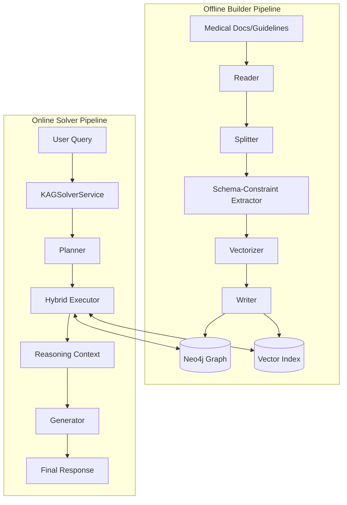
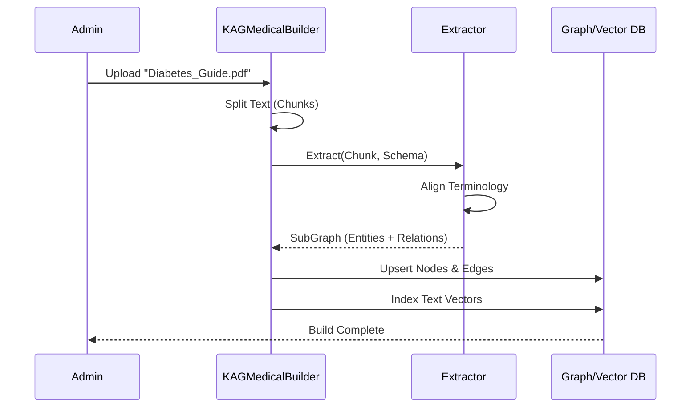
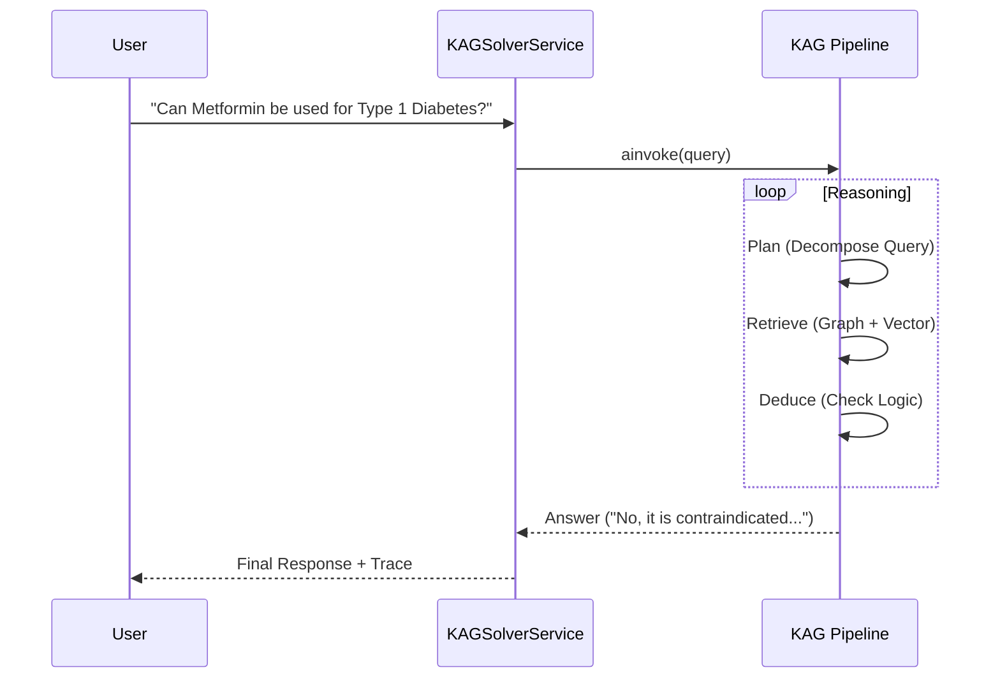

# MedKG KAG Developer Manual

**Target Audience**: Backend Developers, DevOps  
**Version**: KAG 0.8.0 Integration

This manual provides the specific code implementations required to integrate the KAG framework into MedKG. It covers the **Builder** (Knowledge Construction) and **Solver** (Reasoning) components, illustrated with architecture diagrams.

---

## 1. System Architecture

The KAG integration consists of two main loops: the **Offline Building Loop** for ingesting data and the **Online Solving Loop** for answering queries.



---

## 2. Configuration (`kag_config.yaml`)

The `kag_config.yaml` is the centralized configuration. Place it in the project root (`MedKG/kag_config.yaml`).

```yaml
# MedKG/kag_config.yaml

# 1. Project Scope
project:
  id: "1001"
  namespace: "MedicalGovernance"
  host_addr: "http://127.0.0.1:8887"
  biz_scene: "medical"

# 2. Shared Resources (LLM & Embeddings)
chat_llm: &chat_llm
  type: openai
  base_url: "https://api.openai.com/v1"
  api_key: "${OPENAI_API_KEY}"
  model: "gpt-4o"

vectorize_model: &vectorize_model
  type: openai
  model: "text-embedding-3-small"
  vector_dimensions: 1536

# 3. Builder Configuration
unstructured_builder:
  chain:
    type: unstructured_builder_chain
    reader:
      type: pdf_reader
    splitter:
      type: length_splitter
      split_length: 1000
    extractor:
      type: schema_constraint_extractor # Enforces MedKG Schema
      llm: *chat_llm
    writer:
      type: kg_writer
    vectorizer:
      type: batch_vectorizer
      vectorize_model: *vectorize_model

# 4. Solver Configuration
kag_solver_pipeline:
  type: kag_static_pipeline
  planner:
    type: lf_kag_static_planner
    llm: *chat_llm
  executors:
    - type: kag_hybrid_retrieval_executor
      retrievers:
        - type: kg_cs_open_spg # Graph Exact Match
        - type: rc_open_spg # Vector Similarity
  generator:
    type: llm_index_generator
    llm_client: *chat_llm
```

---

## 3. Builder Implementation (Offline)

The **Builder** is responsible for converting raw files (PDFs) into knowledge graph nodes and vector embeddings.



### Code: `backend/app/services/kag_medical_builder.py`

```python
import os
from kag.builder.runner import BuilderChainRunner
from kag.common.conf import KAG_CONFIG
from app.core.config import settings

class KAGMedicalBuilder:
    def __init__(self):
        # Initialize with project config
        self.config_path = os.path.join(settings.PROJECT_ROOT, "kag_config.yaml")
        if not KAG_CONFIG.all_config:
             KAG_CONFIG.init(self.config_path)

    def build_document(self, file_path: str):
        """
        Ingest a medical document (PDF/TXT) into the Knowledge Graph.
        """
        # Load the unstructured builder config
        runner_config = KAG_CONFIG.all_config["unstructured_builder"]

        # Instantiate and run
        runner = BuilderChainRunner.from_config(runner_config)
        runner.invoke(file_path)

        return {"status": "success", "file": file_path}

kag_builder = KAGMedicalBuilder()
```

---

## 4. Solver Implementation (Online)

The **Solver** executes the reasoning pipeline to answer user queries.



### Code: `backend/app/services/kag_solver_service.py`

```python
from kag.solver.main_solver import SolverMain
from kag.common.conf import KAG_CONFIG
from app.core.config import settings
import time

class KAGSolverService:
    def __init__(self):
        self.config_path = os.path.join(settings.PROJECT_ROOT, "kag_config.yaml")
        self.solver = SolverMain()

        # Ensure config is loaded
        if not KAG_CONFIG.all_config:
             KAG_CONFIG.init(self.config_path)

    async def solve(self, query: str):
        """
        Execute a query using the KAG reasoning pipeline.
        """
        # Runtime parameters
        run_params = {
            "usePipeline": "kag_solver_pipeline", # Defines which pipeline to use
        }

        # Async execution
        answer = await self.solver.ainvoke(
            project_id=settings.KAG_PROJECT_ID,
            task_id=self._generate_task_id(),
            query=query,
            params=run_params
        )

        return answer

    def _generate_task_id(self):
        return int(time.time() * 1000)

kag_solver = KAGSolverService()
```

---

## 5. Developer Checklist

- [ ] **Schema Definition**: Ensure `SchemaService` has synced your domain models (e.g., `Disease`, `Drug`) to OpenSPG before running the Builder.
- [ ] **Environment Variables**: Check that `OPENAI_API_KEY` and `KAG_PROJECT_ID` are set in your `.env` file.
- [ ] **Graph Connection**: Verify `NEO4J_URI` is accessible from the backend container.
- [ ] **Testing**: Run `kag_medical_builder.py` with a sample PDF to verify data ingestion before testing the solver.
