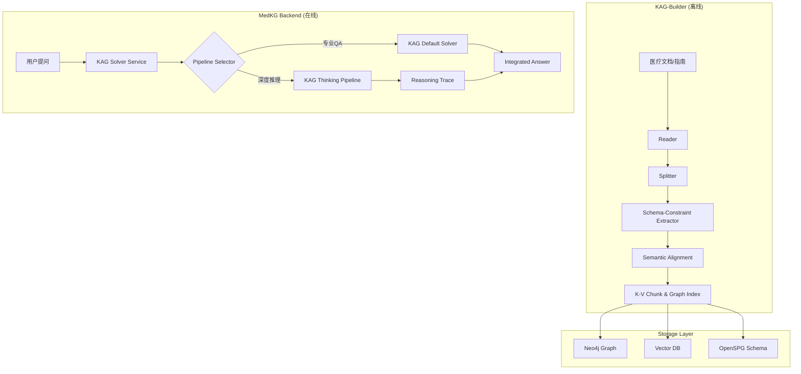

# MedKG - KAG 深度集成指南 (v0.8.0)

本项目旨在将 **KAG (Knowledge Augmented Generation)** 框架深度集成至 **MedKG** 医疗治理业务系统中。通过 KAG 的逻辑推理、专业领域知识表示和互索引能力，提升 MedKG 在医疗专业问答、逻辑合规检查以及知识图谱构建方面的表现。

---

## 1. 核心集成架构

MedKG 与 KAG 的集成遵循“离线图谱构建 + 在线逻辑推理”的双引擎模式。



---

## 2. 环境配置与升级

### 2.1 依赖安装

确保安装了最新版本的 `openspg-kag`：

```bash
cd KAG-master
pip install -e .
```

### 2.2 统一配置文件 (`kag_config.yaml`)

更新根目录下的 `kag_config.yaml`，确保包含 LLM、向量化和知识库配置：

```yaml
project:
  namespace: MedicalGovernance
  host_addr: http://127.0.0.1:8887
  id: "1"

llm:
  type: openai
  api_key: "${OPENAI_API_KEY}"
  base_url: "https://api.openai.com/v1"
  model: "gpt-4o"

vectorizer:
  type: openai
  model: "text-embedding-3-small"

kb:
  - id: "1"
    name: "Medical_Knowledge_Base"
    index_list: ["chunk_index", "graph_index"]
```

---

## 3. 医疗知识构建 (KAG-Builder)

使用 KAG 的 `DefaultUnstructuredBuilderChain` 自动化处理医学 PDF/Word 临床路径和诊疗指南。

### 3.1 定义医疗抽取逻辑

在 `backend/app/services/kag_medical_builder.py` 中实现：

```python
from kag.builder.default_chain import DefaultUnstructuredBuilderChain
from kag.builder.component import PDFReader, WordSplitter, SchemaExtractor
from kag.builder.model import Chunk

def build_medical_kg(file_path: str):
    # 1. 初始化组件
    reader = PDFReader()
    splitter = WordSplitter(chunk_size=1000)
    # 2. 基于 MedKG Schema 的约束抽取
    extractor = SchemaExtractor(schema_free=False)

    # 3. 构造流水线
    chain = DefaultUnstructuredBuilderChain(
        reader=reader,
        splitter=splitter,
        extractor=extractor
    ).build()

    # 4. 执行构建
    chain.invoke(file_path)
```

> [!IMPORTANT] > **Schema-Constraint Extraction**: 开启 `schema_free=False` 可以强制抽取器只提取符合 MedKG 已定义 Schema（如：疾病-症状-检查-药物）的三元组，极大减少噪声。

---

## 4. 逻辑推理与问答 (KAG-Solver)

MedKG 不再推荐直接调用 `KAGSolver.solve`，而是使用 `SolverMain` 来驱动复杂的推理流水线。

### 4.1 升级后的 Solver Service

在 `kag_solver_service.py` 中集成：

```python
from kag.solver.main_solver import SolverMain

class KAGSolverService:
    def __init__(self):
        self.main_solver = SolverMain()

    async def solve_medical_query(self, query: str):
        params = {
            "usePipeline": "think_pipeline", # 启用深度推理
            "config": kag_config_json
        }
        # 调用 ainvoke 获取带 Trace 的结果
        res = await self.main_solver.ainvoke(
            project_id=1,
            task_id=generate_task_id(),
            query=query,
            params=params
        )
        return res
```

### 4.2 互索引检索 (Mutual Indexing)

KAG 0.8.0 默认支持 **Chunk <-> Knowledge Node** 的双向索引。在检索阶段，系统会同时召回相关的实体节点和它们所属的原始文本块，确保推理结果既有事实支撑（图谱），又有上下文信息（文本）。

---

## 5. MedKG 特特色集成建议

### 5.1 医疗术语对齐 (Semantic Alignment)

在 KAG Builder 中配置语义对齐组件，利用 KAG 的 `concept_reasoning` 能力，将不同文档中描述的相同疾病（如“高血压”与“原发性高血压”）自动对齐到 MedKG 的标准术语。

### 5.2 合规性路径检查 (Path Validation)

利用 KAG 的 `LogicForm` 转换能力，将“该患者使用甲钴胺是否符合路径规定”转化为图查询路径，验证临床路径的合规性。

### 5.3 溯源能力 (Explainability)

KAG 返回的 `evidence` 中包含了引用文本块的哈希和权重。MedKG 前端应集成这些溯源信息，允许用户查看到回答背后的原始病历或指南内容。

---

## 6. 验证与运维

- **监控**: 观察 KAG 的 `Reporter` 输出，监控推理步骤的成功率。
- **分层索引**: 对于核心医学常识，建立 `summary_index` 以提升高层级查询效率。
- **MCP 扩展**: 若需实时获取药品价格或最新文献，通过 KAG 的 `mcp_pipeline` 接入外部 API。
